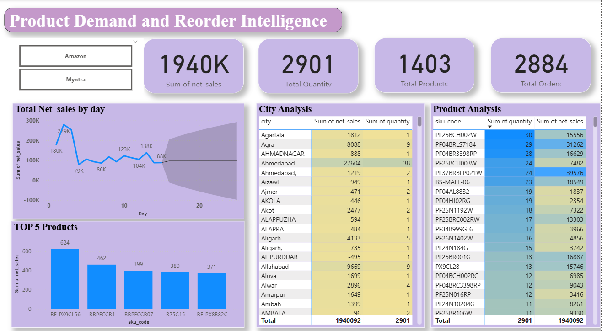

# Sales-Forecasting-Demand-Intelligence
This project focuses on building a data-driven sales forecasting and inventory intelligence solution for a jewellery brand using Power BI.
# 💎 Jewellery Sales Forecasting & Demand Intelligence | Power BI

## 📊 Dashboard Preview

## 📌 Project Overview
This project presents an **end-to-end Business Intelligence solution** built using **Power BI** for a **jewellery brand**, focused on **sales forecasting, product demand analysis, and reorder intelligence**.

The dashboard converts raw transactional data into **actionable insights** to support:
- Short-term sales forecasting
- SKU-level demand tracking
- Inventory planning and reorder decisions
- City and marketplace performance analysis

---

## 🎯 Business Problem
Jewellery retail faces unique challenges:
- High-value inventory
- Fluctuating product demand
- Regional and marketplace-level variability

The business needed clear answers to:
- What will sales look like in the next 30 days?
- Which SKUs are driving demand?
- Which products show declining or negative trends?
- Where should inventory be replenished or optimized?

---

## 📊 Dashboard Features

### 1️⃣ Overall Sales Forecast (30 Days)
- Time-series forecasting of **net sales**
- Confidence intervals to represent forecast uncertainty
- Helps in **revenue planning and inventory budgeting**

### 2️⃣ Product-Level Forecasting
- SKU-wise demand trend analysis
- Identification of:
  - Fast-moving products
  - Declining or low-demand SKUs
- Enables **data-driven reorder planning**

### 3️⃣ Product Demand & Reorder Intelligence
**Key KPIs**
- Total Net Sales  
- Total Quantity Sold  
- Total Orders  
- Total Active Products  

**Analytical Views**
- City-wise sales and quantity contribution
- Top 5 products by revenue
- Marketplace comparison (Amazon vs Myntra)
- Interactive slicers for SKU-level deep dives

---

## 🧠 Key Insights
- A small percentage of SKUs contribute disproportionately to total revenue
- Certain cities consistently outperform others in sales and quantity
- Some products show declining demand and require cautious reordering
- Forecast confidence bands help mitigate inventory risk

---

## 🛠️ Tools & Technologies
- **Power BI**
- **DAX** (Measures, KPIs, trend calculations)
- **Time-Series Forecasting**
- **Interactive Dashboards & Slicers**
- **Retail & E-commerce Analytics**

---

## 📂 Dataset Description
The dataset contains anonymized transactional sales data, including:
- Order date
- SKU code
- Quantity sold
- Net sales value
- City
- Marketplace (Amazon / Myntra)

> ⚠️ Note: Data has been anonymized to maintain confidentiality.

---

## 📈 Business Impact
This dashboard enables:
- Improved demand forecasting accuracy
- Reduced stockouts and excess inventory
- Smarter SKU-level inventory decisions
- Better regional and marketplace performance tracking

---

## 🚀 Future Enhancements
- Automated reorder quantity recommendations
- Seasonality-aware forecasting models
- Python-based forecasting (ARIMA / Prophet)
- Low-stock alerts and exception reporting

---

## 📎 How to Use
1. Download the `.pbix` file
2. Open it in **Power BI Desktop**
3. Refresh the data
4. Use slicers to explore SKUs, cities, and marketplaces

---

## 👩‍💼 About Me
**Prachi Bhuwad**  
Data Analyst | Business Intelligence | Forecasting & Retail Analytics  

📫 Open to **Data Analyst / BI / Forecasting** roles  

---

## ⭐ Repository Tips
**Recommended repo name:**  
`jewellery-sales-forecasting-powerbi`

**Include:**
- `.pbix` file  
- `/images` folder with dashboard screenshots  
- `README.md`

**GitHub Topics:**
`power-bi`, `data-analytics`, `forecasting`, `retail-analytics`, `dax`, `inventory-management`
